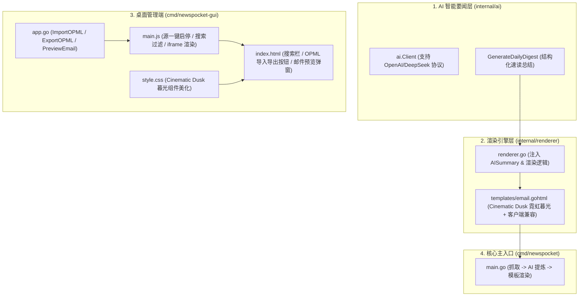

# NewsPocket 核心功能升级实施计划 (AI 速览 · 邮件模板 · GUI 交互)

本计划针对用户选定的三个核心维度（**2: AI 每日要闻速览模块**、**3: Cinematic Dusk 邮件模板排版与兼容性优化**、**4: Wails GUI 桌面端体验升级**）进行完整、健壮、模块化的工程实现。

---

## 用户评审要求 (User Review Required)

> [!IMPORTANT]
> 1. **零成本与完全向后兼容**：
>    - **AI 速览模块**默认即插即用：未配置 `AI_API_KEY` 时自动静默降级，完全不破坏现有的零成本 GitHub Actions 推送和普通早报流程。
>    - 支持标准的 OpenAI / DeepSeek / Moonshot / Ollama / 兼容接口，通过标准 `net/http` 发起调用，无需引入任何庞大的第三方 SDK。
> 2. **OPML 批量导入安全机制**：
>    - 导入 OPML 时自动根据源的 `URL` 进行去重，避免重复添加相同的 RSS 订阅源。
> 3. **GUI 实时预览机制**：
>    - 桌面端预览邮件直接在内存中抓取并调用 `renderer.Render`，在弹窗的 `<iframe>` 中渲染，不写磁盘也不发送真实邮件。

---

## 拟定变更说明 (Proposed Changes)



---

### 1. AI 每日要闻速览模块

#### [NEW] [ai.go](file:///d:/4rchive/Code/NewsPocket/internal/ai/ai.go)
- 实现轻量级 `Client` 结构体：
  - 从环境变量读取：`AI_API_KEY`、`AI_BASE_URL` (默认 `https://api.deepseek.com/v1`)、`AI_MODEL` (默认 `deepseek-chat`)、`AI_TIMEOUT` (默认 45 秒)。
  - `GenerateDailyDigest(ctx context.Context, items []parser.NewsItem) (string, error)`：
    - 精选前 25 条重点资讯的标题与摘要，组装严谨且有洞察力的 Prompt。
    - 发送符合 OpenAI 规范的 JSON Payload (`/chat/completions`)。
    - 针对 API 超时、鉴权失败或网络波动提供完整 Try-Catch 错误拦截与日志记录，失败时安全降级返回空字符串。

#### [NEW] [ai_test.go](file:///d:/4rchive/Code/NewsPocket/internal/ai/ai_test.go)
- 使用 `httptest.Server` 编写单元测试：
  - 测试正常生成 AI 摘要解析；
  - 测试当 API Key 为空或服务端返回 500/超时时的优雅降级与兜底行为。

#### [MODIFY] [main.go](file:///d:/4rchive/Code/NewsPocket/cmd/newspocket/main.go)
- 在去重聚合和模板渲染之间增加 AI 速览步骤：
  - 检查 AI 配置/环境变量；若启用则调用 `ai.NewClient().GenerateDailyDigest(...)`。
  - 将生成的 Markdown 摘要传入 `renderer.TemplateData.AISummary`。

---

### 2. 邮件模板与视觉排版升级 (Cinematic Dusk)

#### [MODIFY] [renderer.go](file:///d:/4rchive/Code/NewsPocket/internal/renderer/renderer.go)
- 在 `TemplateData` 结构体中新增 `AISummary template.HTML` 字段。
- 增加简易 Markdown 转安全 HTML 的处理（或行内结构化渲染），使 AI 输出的要点、粗体和列表在邮件中完美显示。

#### [MODIFY] [email.gohtml](file:///d:/4rchive/Code/NewsPocket/internal/renderer/templates/email.gohtml)
- **AI 要闻速览卡片**：
  - 在 Hero 区域和 Stats 栏下方新增「今日 AI 核心要闻速览」模块。
  - 采用 **Cinematic Dusk** 暮光设计语言：深蓝渐变底色 (`#121829` / `#1a2a4a`)、霓虹暖橙日落光晕 (`#ff6b4a`) 标识点缀。
- **邮件客户端兼容性强化**：
  - 优化内联样式与表格结构，确保在 QQ 邮箱、网易 163 邮箱、Apple Mail 及 Outlook 中背景色和字体颜色对比度清晰，避免暗黑模式反转导致白字白底或黑字黑底。
  - 优化进度条和卡片间距。

#### [NEW] [renderer_test.go](file:///d:/4rchive/Code/NewsPocket/internal/renderer/renderer_test.go)
- 编写模板渲染测试，确保包含/不包含 AI 摘要、各类分类图标及来源进度条均能 100% 正确渲染。

---

### 3. Wails 桌面管理端体验增强 (GUI)

#### [MODIFY] [app.go](file:///d:/4rchive/Code/NewsPocket/cmd/newspocket-gui/app.go)
- **OPML 导入与导出**：
  - `ImportOPML(opmlContent string) (int, error)`：解析 OPML 1.0/2.0 XML 结构，提取 `<outline>` 中的 `xmlUrl`、`text/title`、`category` 等，批量转换为 `config.Source` 并根据 URL 去重合并至当前配置。
  - `ExportOPML() (string, error)`：将当前启用的 RSS 源导出为标准 OPML 2.0 XML 字符串。
- **邮件实时预览接口**：
  - `PreviewEmail() (string, error)`：加载当前启用的源，在内存中执行抓取（支持超时限制与容错）、解析并使用 `renderer.Render` 输出完整 HTML 字符串供前端展示。

#### [MODIFY] [index.html](file:///d:/4rchive/Code/NewsPocket/cmd/newspocket-gui/frontend/index.html)
- 侧边栏：
  - 新增源搜索过滤输入框 `<input id="search-source" placeholder="🔍 搜索新闻源或分类...">`。
- 顶部栏：
  - 新增「📁 导入 OPML」、「📥 导出 OPML」、「📰 预览邮件」按钮。
- 弹窗系统：
  - 新增邮件预览全屏/大弹窗 `<div id="email-preview-modal">`，内嵌自适应 `<iframe id="email-preview-frame">` 与深色/浅色模式切换按钮。

#### [MODIFY] [main.js](file:///d:/4rchive/Code/NewsPocket/cmd/newspocket-gui/frontend/src/main.js)
- 实现源列表快捷一键开关（直接在侧边栏点击 Checkbox 切换启用/禁用状态并自动同步）。
- 实现列表实时关键字搜索过滤（按源名称、URL、分类）。
- 实现 OPML 本地文件选取、解析及合并导入，展示导入成功的源数量提示。
- 实现 OPML 导出并触发浏览器下载保存。
- 实现邮件预览弹窗交互与 `iframe` 内容注入。

#### [MODIFY] [style.css](file:///d:/4rchive/Code/NewsPocket/cmd/newspocket-gui/frontend/src/style.css)
- 添加搜索框、列表切换开关 (Toggle Switch)、OPML 按钮组以及邮件预览弹窗的 Cinematic Dusk 暮光霓虹设计样式。

---

## 验证计划 (Verification Plan)

### 1. 自动化测试 (Automated Tests)
- 运行完整的 Go 单元测试包，涵盖 `ai`、`fetcher`、`parser`、`renderer`、`mailer`：
  ```powershell
  go test -v ./internal/...
  ```

### 2. 手动与集成验证 (Manual Verification)
- **CLI 核心引擎测试模式**：
  ```powershell
  go run ./cmd/newspocket --test
  ```
  检查生成的 `output.html`，验证：
  - 邮件排版是否优雅呈现 Cinematic Dusk 暮光质感；
  - 若配置了 `AI_API_KEY`，邮件顶部是否正确渲染「今日 AI 核心要闻速览」卡片；若未配置是否无缝正常显示。
- **OPML 导入验证**：
  - 在 GUI 或测试用例中导入项目自带的 `hn-popular-blogs-2025.opml`，确认 90+ 订阅源正确解析并合并入列表。
