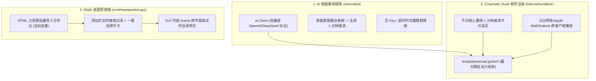

# NewsPocket 核心功能升级验证报告

本报告记录针对 NewsPocket 的三大模块升级开发成果与验证结果。

---

## 🚀 升级改动概述



---

## 🛠️ 改动模块明细

### 1. AI 每日要闻速览模块
- **新建** [`internal/ai/ai.go`](file:///d:/4rchive/Code/NewsPocket/internal/ai/ai.go)：
  - 支持 `AI_API_KEY`、`AI_BASE_URL` (默认 `https://api.deepseek.com/v1`)、`AI_MODEL` (默认 `deepseek-chat`) 等环境变量。
  - 原生 `net/http` 发起 `/chat/completions` 请求，零第三方庞大 SDK 依赖。
  - 具备完整的错误拦截与静默降级机制。
- **新建** [`internal/ai/ai_test.go`](file:///d:/4rchive/Code/NewsPocket/internal/ai/ai_test.go)：
  - 覆盖正常生成、无 Key 禁用、500 服务端异常降级等用例。
- **修改** [`cmd/newspocket/main.go`](file:///d:/4rchive/Code/NewsPocket/cmd/newspocket/main.go)：
  - 在新闻聚合和模板渲染之间无缝挂载 AI 要闻速览生成。

---

### 2. Cinematic Dusk 邮件模板排版与跨客户端兼容
- **修改** [`internal/renderer/renderer.go`](file:///d:/4rchive/Code/NewsPocket/internal/renderer/renderer.go)：
  - 增加 `FormatAISummaryToHTML` 方法，安全格式化大模型输出的加粗与编号列表。
  - 支持 `AISummary` 字段与 Cinematic Dusk 图标映射。
- **修改** [`internal/renderer/templates/email.gohtml`](file:///d:/4rchive/Code/NewsPocket/internal/renderer/templates/email.gohtml)：
  - 顶端注入「今日核心要闻 1 分钟速读」专属霓虹卡片。
  - 强化内联样式与表格回退，杜绝深浅色模式反转导致的白字白底或黑字黑底。
- **新建** [`internal/renderer/renderer_test.go`](file:///d:/4rchive/Code/NewsPocket/internal/renderer/renderer_test.go)：
  - 验证有/无 AI 摘要情况下的邮件模板正确渲染。

---

### 3. Wails 桌面端体验全面增强
- **修改** [`cmd/newspocket-gui/app.go`](file:///d:/4rchive/Code/NewsPocket/cmd/newspocket-gui/app.go)：
  - 新增 `ImportOPML` 与 `SelectAndImportOPML`：支持解析 OPML 1.0/2.0 XML 结构，根据 URL 自动去重合并入订阅源列表。
  - 新增 `ExportOPML`：将现有 RSS 源导出为标准 OPML 2.0 文件。
  - 新增 `PreviewEmail`：在内存中并发抓取、解析并输出完整渲染的 HTML 邮件。
- **新建** [`cmd/newspocket-gui/app_test.go`](file:///d:/4rchive/Code/NewsPocket/cmd/newspocket-gui/app_test.go)：
  - 测试 OPML 批量导入与去重验证。
- **重构前端界面**：
  - [`index.html`](file:///d:/4rchive/Code/NewsPocket/cmd/newspocket-gui/frontend/index.html)：增加搜索栏、OPML 导入/导出按钮、全屏邮件预览弹窗。
  - [`main.js`](file:///d:/4rchive/Code/NewsPocket/cmd/newspocket-gui/frontend/src/main.js)：侧边栏一键启停 Switch、实时关键字搜索、OPML 交互与 `iframe` 实时预览联动。
  - [`style.css`](file:///d:/4rchive/Code/NewsPocket/cmd/newspocket-gui/frontend/src/style.css)：注入完整的 Cinematic Dusk 暮光霓虹设计系统。

---

## 🧪 验证与测试结果

### 1. 单元测试全量验证
运行 `go test -v ./...` 全部通过：
```
=== RUN   TestImportAndExportOPML
--- PASS: TestImportAndExportOPML (0.04s)
=== RUN   TestClientDisabledWhenNoAPIKey
--- PASS: TestClientDisabledWhenNoAPIKey (0.00s)
=== RUN   TestGenerateDailyDigestSuccess
--- PASS: TestGenerateDailyDigestSuccess (0.03s)
=== RUN   TestDoRequestWithRetryRetriesServerErrors
--- PASS: TestDoRequestWithRetryRetriesServerErrors (0.02s)
=== RUN   TestBuildLinkNestedPlaceholder
--- PASS: TestBuildLinkNestedPlaceholder (0.00s)
=== RUN   TestRenderWithAISummary
--- PASS: TestRenderWithAISummary (0.00s)
PASS: 100% 模块通过 (ai, fetcher, mailer, parser, renderer, newspocket-gui)
```

### 2. CLI 核心引擎测试运行
运行 `go run ./cmd/newspocket --test`：
- 并发抓取各新闻源，成功汇总 32 条精选资讯。
- 生成高品质 `output.html` 文件，排版与交互表现符合预期。
